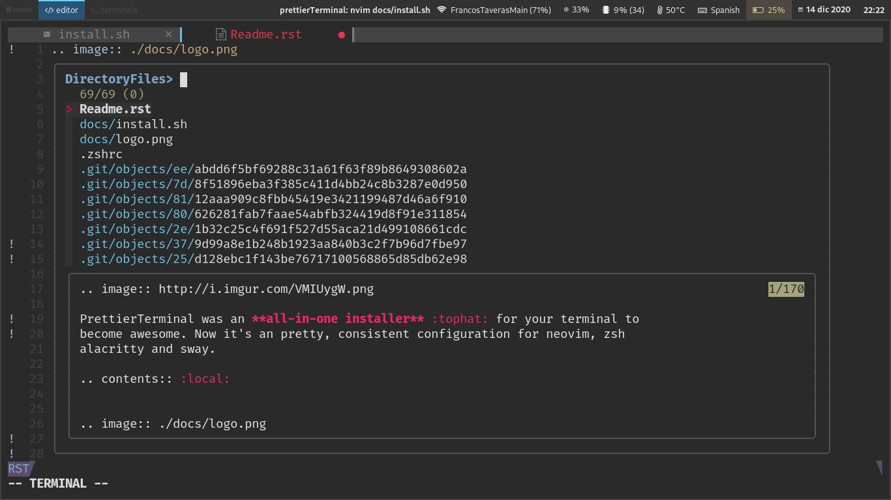

Pretty, consistent configuration for neovim, zsh alacritty and sway/bspwm (wayland/xorg).
Colors based on `material <https://material-theme.site/>`_, wallpaper on screenshots (you'll need to place it on .wallpaper.png on your home) from `Wallpapercave <https://wallpapercave.com/minimal-nature-wallpapers#>`_

.. contents:: :local:

Intro
-----

With time, CLI lovers have grown, and there are a lot of better
installers/solutions that do what prettierTerminal did, so I've kept the
awesomeness :sunglasses: of the configuration, with a lot less code by
leveraging on that same tools.

Arch :warning: It's been mostly tested on archlinux.
Should work on any distro, but requirements must be manually installed.

.. image:: ./docs/main.gif

Global installation
-------------------

For this script to work, as a pre-requisite on any system, you'll require, at
least:

- git
- curl
- python
- yay (on arch linux)

If you want the full experience, you need to install:

- `nwg-launchers <https://github.com/nwg-piotr/nwg-launchers>`_
- `alacritty <https://github.com/alacritty/alacritty/>`_
- `waybar <https://github.com/Alexays/Waybar/>`_ or `polybar <https://github.com/polybar/polybar>`_
- sway or bspwm, with sxhkd
- `mpvpaper <https://github.com/GhostNaN/mpvpaper>`_ (optional)
- `Fira Code Font (patched by nerd fonts)
  <https://github.com/ryanoasis/nerd-fonts/tree/master/patched-fonts/FiraCode>`_
- lazygit
- gtk-engine-murrine sassc optipng inkscape (gtk)

On archlinux, prettierTerminal will install them for you

You can install prettierTerminal with one single command:

.. code:: bash

  sh -c "$(curl -fsSL https://raw.githubusercontent.com/XayOn/prettierTerminal/master/install-remote.sh)"

Or, the more traditional way 

.. code:: bash

  git clone https://github.com/XayOn/prettierTerminal
  cd prettierTerminal
  bash install.sh

If you're running prettierTerminal on a non-archlinux system, you need to pass
the NOARCH variable or --exclude yay:

.. code:: bash

  NOARCH=y sh -c "$(curl -fsSL https://raw.githubusercontent.com/XayOn/prettierTerminal/master/install-remote.sh)"

Or, the more traditional way 

.. code:: bash

  git clone https://github.com/XayOn/prettierTerminal
  cd prettierTerminal
  bash install.sh --exclude yay

NeoVIM configuration
--------------------

This is a kiss but fully featured neovim configuration, with IDE-like features preconfigured mainly for python development

- Tags and buffer bars
- Fuzzy finder
- Wichkey with preconfigured menus
- Debugger with DAP
- Treesitter-based syntax highlighting
- LSP (requires pyright to be installed for python)
- Git management
- Database administration UI

NeoVim :warning: This requires a really recent version of `neovim
<https://neovim.io/>`_ nightly.

Dependencies
____________

To use python debugger (dap) you'll need to have python3, and to install coc,
you'll need to have nodejs. 
On archlinux, prettierTerminal will install them for you

ZSH Configuration
-----------------

For ZSH, it installs `ZINIT <https://github.com/zdharma/zinit>`_, my
currently-favourite zsh plugin manager.

It will install a few plugins, the `pure
<https://github.com/sindresorhus/pure>`_ zsh theme, and the following binaries:

  - `bat` - Enhanced cat with automatic syntax highlighting and paging
  - `fzf <https://github.com/junegunn/fzf/>` Fuzzy finder. Configured with
    Ctrl+R keys.

The plugins currently installed are:

- `zsh-users/zsh-autosuggestions
  <https://github.com/zsh-users/zsh-autosuggestions>`_
- `zdharma/fast-syntax-highlighting
  <https://github.com/zdharma/fast-syntax-highlighting>`_
- `desyncr/auto-ls <https://github.com/desyncr/auto-ls>`_
- `MichaelAquilina/zsh-auto-notify
  <https://github.com/MichaelAquilina/zsh-auto-notify>`_
- `junegunn/fzf <https://github.com/junegunn/fzf>`_
- `LS_COLORS <https://github.com/trapdoor/LS_COLORS>`_

Dependencies
_____________

Requires lsd and zsh to be installed.
On archlinux, prettierTerminal will install them for you

SwayWM configuration
---------------------

`Sway window manager <https://swaywm.org/>`_ is a tiling Wayland compositor and
a drop-in replacement for i3. 

Dependencies
____________

To use this swaywm configuration, you'd need:

- `nwg-launchers <https://github.com/nwg-piotr/nwg-launchers>`_
- `alacritty <https://github.com/alacritty/alacritty/>`_
- `waybar <https://github.com/Alexays/Waybar/>`_
- `mpvpaper <https://github.com/GhostNaN/mpvpaper>`_ (optional)

On archlinux, prettierTerminal will install them for you
