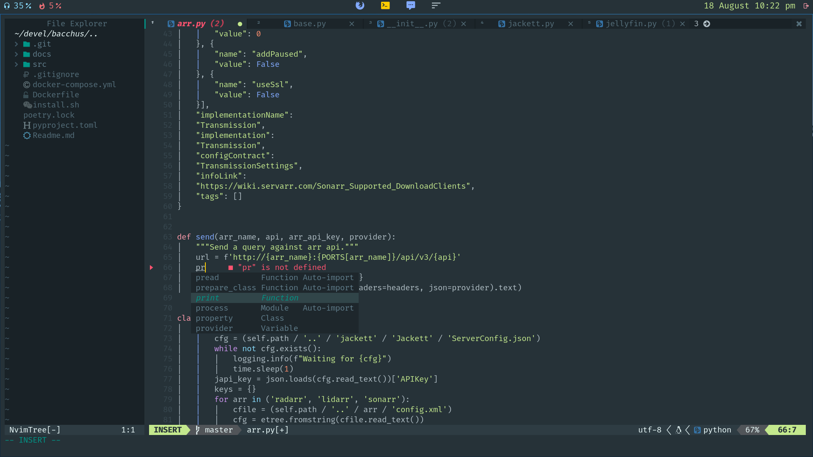

Pretty, consistent configuration for neovim, zsh alacritty and bspwm.

Its bases are:

- Keyboard centric
- Minimalistic (as much as it can be). Four main colors (fg, bg, warning, error)
- Config files should not be bloated (this includes documentation)
- Colors based on `material <https://material-theme.site/>`_

Wallpaper on screenshots (you'll need to place it on .wallpaper.png on your
home) is from `Wallpapercave <https://wallpapercave.com/minimal-nature-wallpapers#>`_

Works well with `my moonlander configuration <https://configure.zsa.io/moonlander/layouts/xMmq0/latest/0>`_

.. contents:: :local:

Screenshots
------------

There's no better way to show a rice than screenshots. 
Here goes clean, neovim and tmux:

Mandatory gif too:

.. image:: ./docs/main.gif

Global installation
-------------------

Uses DotBot to install, should work on any system with:

- git
- curl
- python
- yay or apt

You can install prettierTerminal with one single command:

.. code:: bash

  sh -c "$(curl -fsSL https://raw.githubusercontent.com/XayOn/prettierTerminal/master/install-remote.sh)"

Or, the more traditional way 

.. code:: bash

  git clone https://github.com/XayOn/prettierTerminal
  cd prettierTerminal
  bash install.sh

Manual dependencies installation

- neovim nightly
- `alacritty <https://github.com/alacritty/alacritty/>`
- `Fira Code Font (patched by nerd fonts) <https://github.com/ryanoasis/nerd-fonts/tree/master/patched-fonts/FiraCode>`_
- lazygit, node, pyright, lsd, zsh
- Materia gtk theme https://github.com/nana-4/materia-theme

NeoVIM configuration
--------------------

This is a kiss but fully featured neovim configuration, with IDE-like features
preconfigured, mainly for python development

- Lots of UI goodies. Makes the experience a tad similar to modern IDEs,
  without most of the crappy parts.
- Wichkey with preconfigured menus
- Git management with lazygit
- Database administration UI
- The trinity of modern neovim configs:
    - Treesitter-based syntax highlighting
    - Debugger with DAP
    - LSP (requires pyright to be installed for python)

:warning: This requires a really recent version of `neovim <https://neovim.io/>`_ nightly.

Press leader (,) to see a nice menu with the leader-prefixed keybindings.
Default vim keybindings will work as usuarl

Dependencies
____________

Neovim-nightly is required, with:

- python3 
- pip
- nodejs
- pyright (pip install pyright)
- lazygit (you'll have to manually install this one)

ZSH Configuration
-----------------

For ZSH, it installs `ZINIT <https://github.com/zdharma/zinit>`_, my
currently-favourite zsh plugin manager.

It will install a few plugins, the `pure
<https://github.com/sindresorhus/pure>`_ zsh theme, and the following binaries:

  - `bat` - Enhanced cat with automatic syntax highlighting and paging
  - `fzf <https://github.com/junegunn/fzf/>` Fuzzy finder. Configured with
    Ctrl+R keys.

The plugins currently installed are:

- `zsh-users/zsh-autosuggestions
  <https://github.com/zsh-users/zsh-autosuggestions>`_
- `zdharma/fast-syntax-highlighting
  <https://github.com/zdharma/fast-syntax-highlighting>`_
- `desyncr/auto-ls <https://github.com/desyncr/auto-ls>`_
- `MichaelAquilina/zsh-auto-notify
  <https://github.com/MichaelAquilina/zsh-auto-notify>`_
- `junegunn/fzf <https://github.com/junegunn/fzf>`_
- `LS_COLORS <https://github.com/trapdoor/LS_COLORS>`_

BSPWM configuration
---------------------

BSPWM is a lightweight tiling window manager

Keybindings are defined in sxhkdrc

Dependencies
____________

To use this bspwm configuration, you'd need:

- bspwm
- rofi
- sxhkd
- polybar
- i3lock-fancy
- materia-gtk-theme
